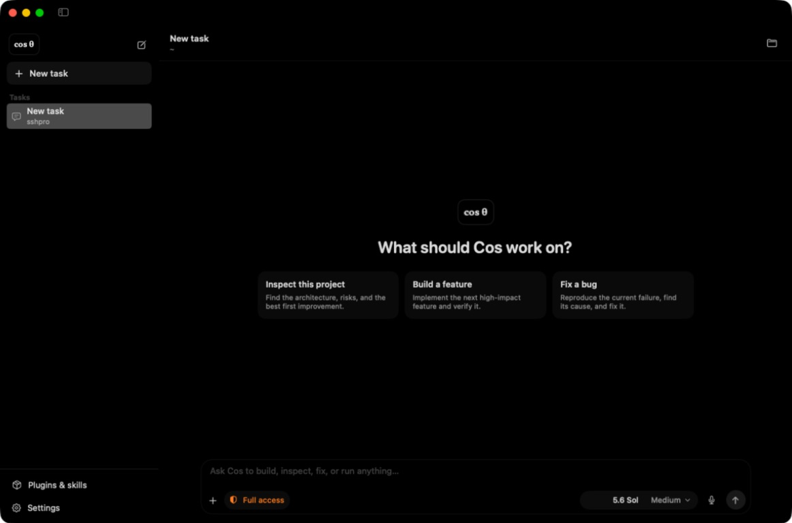
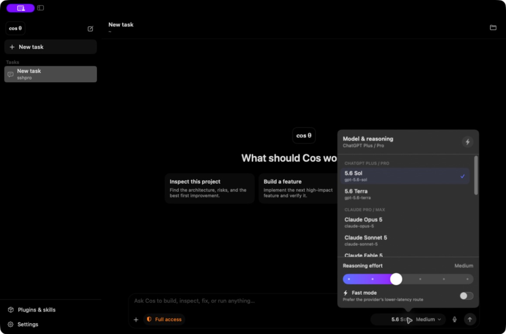
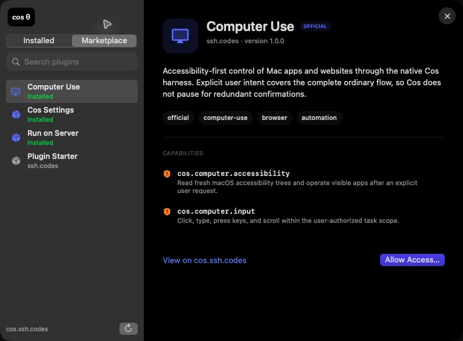

<p align="center">
  
</p>

<h1 align="center">Cos</h1>

<p align="center">
  A fast, native macOS workspace and provider-neutral harness for agentic coding.
</p>

<p align="center">
  <a href="https://github.com/SSHDotCodes/Cos/actions/workflows/ci.yml"></a>
  <a href="https://github.com/SSHDotCodes/Cos/releases/latest"></a>
  <a href="LICENSE"></a>
  
</p>

<p align="center">
  <a href="https://cos.ssh.codes"><strong>Website</strong></a> ·
  <a href="https://github.com/SSHDotCodes/Cos/releases/latest"><strong>Download</strong></a> ·
  <a href="https://cos.ssh.codes/#marketplace"><strong>Plugin marketplace</strong></a> ·
  <a href="docs/ARCHITECTURE.md"><strong>Architecture</strong></a>
</p>



Cos keeps the entire agent loop in one lightweight Swift runtime: provider streaming, goals, compaction, tools, plugins, skills, credentials, and task history. It does not keep a browser runtime alive or hand the task to a second coding-agent harness.

## Why Cos

- **Native and lean.** SwiftUI, direct provider transports, macOS Keychain, bounded work traces, and no Electron runtime.
- **One harness for every model.** ChatGPT, Anthropic, xAI, Qwen, OpenCode Go, Pi, and custom OpenAI-compatible endpoints use the same Cos tool loop.
- **Long-running tasks that stay coherent.** Persistent `/goal` state and compacted checkpoints preserve intent while controlling context growth.
- **Model-aware controls.** Each model exposes only the reasoning levels and Fast Mode capability it supports.
- **A real extension system.** Import portable Codex and Claude Code skills, install from the in-app marketplace, or create capability-scoped Cos plugins.
- **Computer Use built in.** Accessibility-first Mac control follows explicit user intent without redundant stops while retaining safety boundaries for consequential actions.
- **Local credentials.** BYOK values are device-only Keychain items; subscription helpers use provider-owned local sessions.

## Interface

| Model-aware reasoning | In-app plugins and skills |
| --- | --- |
|  |  |

The interface includes System, Light, Dark, and True Dark themes, an expandable work trace that collapses after the final response, quiet update notifications, native settings, directory trust prompts, and a compact Codex-style composer.

## Install

Cos 1.0 supports Apple silicon Macs running macOS 15 or later.

1. Download the [Cos 1.0 DMG](https://github.com/SSHDotCodes/Cos/releases/download/v1.0.0/Cos-1.0.0.dmg) or [ZIP](https://github.com/SSHDotCodes/Cos/releases/download/v1.0.0/Cos-1.0.0-macOS-arm64.zip).
2. Move `Cos.app` to Applications.
3. Open Cos and configure a provider in **Settings → Providers**.

The 1.0 community build is ad-hoc signed, not Apple-notarized. On first launch, macOS may require **System Settings → Privacy & Security → Open Anyway**. See [Security](docs/SECURITY.md) for the trust model and current distribution limitations.

## Goals

```text
/goal Ship a working release
/goal --budget 100000 Ship a working release
/goal status
/goal complete
/goal clear
```

Goals persist with the task and remain part of compacted agent context.

## Providers and credentials

Cos supports provider subscription helpers as well as BYOK. Availability of a model still depends on the connected provider account.

| Provider route | Credential source |
| --- | --- |
| ChatGPT | Local ChatGPT/Codex subscription session or OpenAI API key |
| Anthropic | Local Claude subscription session or Anthropic API key |
| xAI / Grok | Local xAI session or compatible API credential |
| OpenCode Go | Provider token |
| Qwen Token Plan | Provider token |
| Custom endpoint | Base URL, model ID, and Keychain-stored API key |

BYOK values are stored as generic-password items under the `codes.ssh.cos` Keychain service with device-only accessibility. Read the implementation and limitations in [Provider setup](docs/PROVIDERS.md) and [Security](docs/SECURITY.md).

## Build from source

Requirements: macOS 15+, Xcode/Swift 6.2 or later, and Node 20+ for the marketplace tests.

```sh
git clone https://github.com/SSHDotCodes/Cos.git
cd Cos
swift test --scratch-path /tmp/cos-test-build
scripts/run_debug.sh
```

Create the same ad-hoc-signed release artifacts used by the public workflow:

```sh
scripts/build_release.sh
npm test --prefix web
```

Artifacts are written to `outputs/` and intentionally excluded from Git. Tagged releases publish the DMG, architecture-specific ZIP, source archive, and SHA-256 checksums through GitHub Actions.

## Repository map

```text
Sources/CosCore   Provider transports, harness, tools, compaction, updates
Sources/Cos       Native SwiftUI application and built-in plugins
Tests             Core behavior and update tests
web               Zero-dependency marketplace and download service
docs              Architecture, provider, plugin, and security notes
scripts           Debug and release packaging
```

## Plugins and skills

The built-in Cos plugin can manage allowlisted preferences and Cos-owned skills/plugins. Marketplace packages declare capabilities in a readable manifest before installation. Start with [Plugin development](docs/PLUGINS.md) or browse [cos.ssh.codes](https://cos.ssh.codes/#marketplace).

## Contributing

Issues and focused pull requests are welcome. Please read [CONTRIBUTING.md](CONTRIBUTING.md) and the [security policy](SECURITY.md) before opening one. CI runs Swift tests on an Apple-silicon macOS runner and the marketplace suite on Linux.

## License

Cos is available under the [MIT License](LICENSE).
